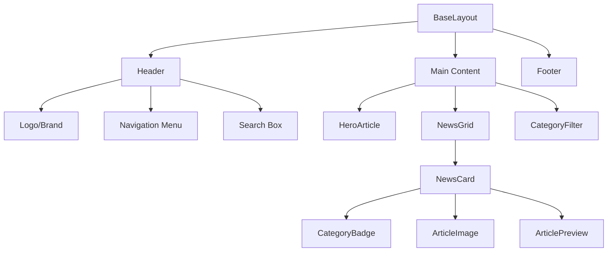
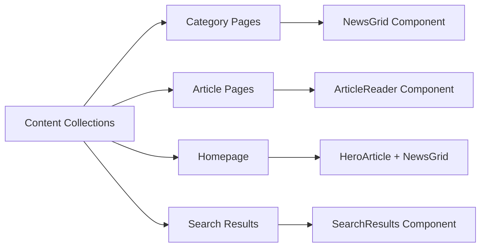

# 🏗️ Technical Architecture Plan: idag.ai - Apple Newsroom Style

## 📋 Project Overview
**Goal**: Recreate Apple's Swedish Newsroom design for AI news content using Astro + Cloudflare Workers
**Branding**: "Idag, allt om AI. Sveriges största informationskälla inom AI"
**Categories**: AI NYHETER, TEKNIK, ANALYS, TRENDER, FÖRETAG

## 🗂️ File Structure Architecture

```
idag-ai/
├── src/
│   ├── components/
│   │   ├── layout/
│   │   │   ├── Header.astro              # Apple-style navigation
│   │   │   ├── Footer.astro              # Site footer
│   │   │   └── BaseHead.astro            # SEO & meta tags
│   │   ├── news/
│   │   │   ├── HeroArticle.astro         # Featured article component
│   │   │   ├── NewsCard.astro            # Article card component
│   │   │   ├── NewsGrid.astro            # Two-column grid layout
│   │   │   ├── CategoryBadge.astro       # Category labels
│   │   │   └── ArticleReader.astro       # Article reading view
│   │   ├── ui/
│   │   │   ├── SearchBox.astro           # Search functionality
│   │   │   ├── ShareButtons.astro        # Social sharing
│   │   │   ├── LoadingSpinner.astro      # Loading states
│   │   │   └── Pagination.astro          # Article pagination
│   │   └── seo/
│   │       ├── StructuredData.astro      # JSON-LD schema
│   │       └── OpenGraph.astro           # Social media meta
│   ├── content/
│   │   ├── news/                         # AI news articles
│   │   │   ├── ai-nyheter/              # AI News category
│   │   │   ├── teknik/                  # Technology category
│   │   │   ├── analys/                  # Analysis category
│   │   │   ├── trender/                 # Trends category
│   │   │   └── foretag/                 # Companies category
│   │   └── config.ts                    # Content collections config
│   ├── layouts/
│   │   ├── BaseLayout.astro             # Main layout wrapper
│   │   ├── NewsLayout.astro             # News article layout
│   │   └── CategoryLayout.astro         # Category page layout
│   ├── pages/
│   │   ├── index.astro                  # Homepage with hero + grid
│   │   ├── search.astro                 # Search results page
│   │   ├── kategori/
│   │   │   ├── [category].astro         # Dynamic category pages
│   │   │   └── index.astro              # All categories overview
│   │   ├── artikel/
│   │   │   └── [...slug].astro          # Dynamic article pages
│   │   ├── rss.xml.js                   # RSS feed
│   │   └── sitemap.xml.js               # XML sitemap
│   ├── styles/
│   │   ├── global.css                   # Base styles
│   │   ├── apple-newsroom.css           # Apple-inspired design system
│   │   ├── components.css               # Component-specific styles
│   │   └── responsive.css               # Mobile-first responsive design
│   ├── utils/
│   │   ├── content.ts                   # Content helper functions
│   │   ├── seo.ts                       # SEO utilities
│   │   ├── search.ts                    # Search functionality
│   │   └── date.ts                      # Date formatting (Swedish)
│   └── consts.ts                        # Site constants
├── public/
│   ├── images/
│   │   ├── articles/                    # Article images
│   │   ├── categories/                  # Category icons
│   │   └── brand/                       # Logo and branding
│   ├── icons/                           # SVG icons
│   └── fonts/                           # Typography assets
└── functions/                           # Cloudflare Workers
    ├── search.ts                        # Search API endpoint
    ├── analytics.ts                     # Analytics tracking
    └── newsletter.ts                    # Newsletter signup
```

## 🧩 Component Architecture

### Core Layout Components



### Content Flow Architecture



## 📝 Content Schema Design

### Enhanced Content Collections Configuration

```typescript
// src/content.config.ts
import { defineCollection, z } from 'astro:content';

const newsCollection = defineCollection({
  type: 'content',
  schema: z.object({
    title: z.string(),
    description: z.string(),
    pubDate: z.coerce.date(),
    updatedDate: z.coerce.date().optional(),
    heroImage: z.string(),
    heroImageAlt: z.string(),
    category: z.enum(['ai-nyheter', 'teknik', 'analys', 'trender', 'foretag']),
    tags: z.array(z.string()).optional(),
    author: z.string().default('idag.ai Redaktion'),
    featured: z.boolean().default(false),
    readingTime: z.number().optional(),
    seoTitle: z.string().optional(),
    seoDescription: z.string().optional(),
    socialImage: z.string().optional(),
    relatedArticles: z.array(z.string()).optional(),
    sources: z.array(z.object({
      title: z.string(),
      url: z.string(),
      publishedAt: z.coerce.date().optional()
    })).optional()
  })
});

export const collections = {
  news: newsCollection
};
```

### Article Frontmatter Example

```yaml
---
title: "OpenAI lanserar GPT-5 med revolutionerande kapaciteter"
description: "Den nya AI-modellen GPT-5 introducerar banbrytande funktioner som förändrar landskapet för artificiell intelligens."
pubDate: 2024-01-15
heroImage: "/images/articles/gpt5-launch.jpg"
heroImageAlt: "OpenAI GPT-5 logotyp på modern bakgrund"
category: "ai-nyheter"
tags: ["OpenAI", "GPT-5", "språkmodeller", "AI-utveckling"]
featured: true
readingTime: 4
seoTitle: "GPT-5 lansering: Allt du behöver veta om OpenAIs nya AI-modell"
seoDescription: "Komplett guide till GPT-5s nya funktioner, kapaciteter och vad det betyder för framtiden av AI. Läs mer på idag.ai."
socialImage: "/images/social/gpt5-social.jpg"
sources:
  - title: "OpenAI Official Announcement"
    url: "https://openai.com/gpt5"
    publishedAt: 2024-01-15
---
```

## 🎨 Apple-Inspired Design System

### CSS Architecture Strategy

```css
/* src/styles/apple-newsroom.css */
:root {
  /* Apple-inspired Color Palette */
  --color-primary: #000000;
  --color-secondary: #86868b;
  --color-tertiary: #f5f5f7;
  --color-accent: #0071e3;
  --color-success: #30d158;
  --color-warning: #ff9500;
  --color-error: #ff3b30;
  
  /* Typography Scale */
  --font-family-primary: -apple-system, BlinkMacSystemFont, 'Segoe UI', Roboto, sans-serif;
  --font-size-hero: clamp(2.5rem, 5vw, 4rem);
  --font-size-h1: clamp(1.75rem, 3vw, 2.5rem);
  --font-size-h2: clamp(1.5rem, 2.5vw, 2rem);
  --font-size-body: 1rem;
  --font-size-small: 0.875rem;
  
  /* Spacing System */
  --spacing-xs: 0.5rem;
  --spacing-sm: 1rem;
  --spacing-md: 1.5rem;
  --spacing-lg: 2rem;
  --spacing-xl: 3rem;
  --spacing-2xl: 4rem;
  
  /* Layout */
  --container-max-width: 1200px;
  --grid-gap: 2rem;
  --border-radius: 12px;
  --border-radius-sm: 8px;
}

/* Apple-style Grid System */
.news-grid {
  display: grid;
  grid-template-columns: repeat(auto-fit, minmax(350px, 1fr));
  gap: var(--grid-gap);
  max-width: var(--container-max-width);
  margin: 0 auto;
  padding: 0 var(--spacing-lg);
}

/* Apple-style Cards */
.news-card {
  background: white;
  border-radius: var(--border-radius);
  overflow: hidden;
  transition: transform 0.3s ease, box-shadow 0.3s ease;
  border: 1px solid rgba(0, 0, 0, 0.1);
}

.news-card:hover {
  transform: translateY(-4px);
  box-shadow: 0 20px 40px rgba(0, 0, 0, 0.1);
}
```

### Typography System

```css
/* Typography inspired by Apple's design */
.typography-hero {
  font-size: var(--font-size-hero);
  font-weight: 700;
  line-height: 1.1;
  letter-spacing: -0.02em;
}

.typography-headline {
  font-size: var(--font-size-h1);
  font-weight: 600;
  line-height: 1.2;
  letter-spacing: -0.01em;
}

.typography-subheadline {
  font-size: var(--font-size-h2);
  font-weight: 500;
  line-height: 1.3;
}

.typography-body {
  font-size: var(--font-size-body);
  font-weight: 400;
  line-height: 1.6;
}

.typography-caption {
  font-size: var(--font-size-small);
  font-weight: 400;
  line-height: 1.4;
  color: var(--color-secondary);
}
```

## 🔍 Search & Performance Strategy

### Search Implementation with Cloudflare Workers

```typescript
// functions/search.ts
export async function onRequest(context) {
  const { request, env } = context;
  const url = new URL(request.url);
  const query = url.searchParams.get('q');
  
  if (!query) {
    return new Response(JSON.stringify({ results: [] }), {
      headers: { 'Content-Type': 'application/json' }
    });
  }
  
  // Implement search logic using Cloudflare KV or external search service
  const searchResults = await performSearch(query, env);
  
  return new Response(JSON.stringify({ results: searchResults }), {
    headers: { 
      'Content-Type': 'application/json',
      'Cache-Control': 'public, max-age=300'
    }
  });
}

async function performSearch(query: string, env: any) {
  // Simple implementation - in production, use more sophisticated search
  const articles = await env.ARTICLES_KV.list();
  const results = [];
  
  for (const key of articles.keys) {
    const article = await env.ARTICLES_KV.get(key.name, 'json');
    if (article.title.toLowerCase().includes(query.toLowerCase()) ||
        article.description.toLowerCase().includes(query.toLowerCase())) {
      results.push(article);
    }
  }
  
  return results.slice(0, 10); // Limit to 10 results
}
```

### Client-side Search Component

```typescript
// src/utils/search.ts
export interface SearchResult {
  title: string;
  description: string;
  slug: string;
  category: string;
  pubDate: string;
  heroImage: string;
}

export async function searchArticles(query: string): Promise<SearchResult[]> {
  if (!query.trim()) return [];
  
  try {
    const response = await fetch(`/api/search?q=${encodeURIComponent(query)}`);
    const data = await response.json();
    return data.results || [];
  } catch (error) {
    console.error('Search error:', error);
    return [];
  }
}

export function highlightSearchTerms(text: string, query: string): string {
  if (!query.trim()) return text;
  
  const regex = new RegExp(`(${query})`, 'gi');
  return text.replace(regex, '<mark>$1</mark>');
}
```

## 📱 Responsive Design Strategy

### Mobile-First Approach

```css
/* Mobile-first responsive design */
.hero-section {
  padding: var(--spacing-lg) var(--spacing-sm);
}

.hero-article {
  display: flex;
  flex-direction: column;
  gap: var(--spacing-md);
}

.hero-article__image {
  width: 100%;
  aspect-ratio: 16/9;
  object-fit: cover;
  border-radius: var(--border-radius);
}

.hero-article__content {
  flex: 1;
}

/* Tablet and up */
@media (min-width: 768px) {
  .hero-article {
    flex-direction: row;
    align-items: center;
  }
  
  .hero-article__image {
    width: 50%;
    aspect-ratio: 4/3;
  }
  
  .news-grid {
    grid-template-columns: repeat(2, 1fr);
  }
}

/* Desktop */
@media (min-width: 1024px) {
  .hero-section {
    padding: var(--spacing-2xl) var(--spacing-lg);
  }
  
  .hero-article__image {
    width: 60%;
  }
}

/* Large screens */
@media (min-width: 1440px) {
  .news-grid {
    grid-template-columns: repeat(3, 1fr);
  }
}
```

### Component Responsive Patterns

```css
/* News Card Responsive Design */
.news-card {
  display: flex;
  flex-direction: column;
  height: 100%;
}

.news-card__image {
  width: 100%;
  aspect-ratio: 16/9;
  object-fit: cover;
}

.news-card__content {
  padding: var(--spacing-md);
  flex: 1;
  display: flex;
  flex-direction: column;
}

.news-card__title {
  margin-bottom: var(--spacing-sm);
  flex: 1;
}

.news-card__meta {
  margin-top: auto;
  display: flex;
  justify-content: space-between;
  align-items: center;
  font-size: var(--font-size-small);
  color: var(--color-secondary);
}

@media (max-width: 480px) {
  .news-card__content {
    padding: var(--spacing-sm);
  }
}
```

## 🚀 Performance Optimization

### Astro + Cloudflare Best Practices

1. **Static Generation**: Pre-render all article pages at build time
2. **Image Optimization**: Use Astro's built-in image optimization
3. **Code Splitting**: Lazy load non-critical components
4. **CDN Caching**: Leverage Cloudflare's global CDN
5. **Critical CSS**: Inline critical styles for above-the-fold content

### Performance Configuration

```javascript
// astro.config.mjs
import { defineConfig } from 'astro/config';
import mdx from '@astrojs/mdx';
import sitemap from '@astrojs/sitemap';
import cloudflare from '@astrojs/cloudflare';

export default defineConfig({
  site: 'https://idag.ai',
  integrations: [
    mdx(),
    sitemap(),
  ],
  adapter: cloudflare({
    platformProxy: { enabled: true }
  }),
  build: {
    inlineStylesheets: 'auto'
  },
  vite: {
    build: {
      cssCodeSplit: true,
      rollupOptions: {
        output: {
          manualChunks: {
            'search': ['./src/utils/search.ts'],
            'analytics': ['./src/utils/analytics.ts']
          }
        }
      }
    }
  }
});
```

### Image Optimization Strategy

```typescript
// src/utils/images.ts
export function getOptimizedImageUrl(
  src: string, 
  width: number, 
  height?: number,
  format: 'webp' | 'avif' | 'jpg' = 'webp'
): string {
  // Use Cloudflare Image Resizing
  const baseUrl = 'https://idag.ai/cdn-cgi/image';
  const params = new URLSearchParams({
    width: width.toString(),
    format,
    quality: '85'
  });
  
  if (height) {
    params.set('height', height.toString());
    params.set('fit', 'cover');
  }
  
  return `${baseUrl}/${params.toString()}/${src}`;
}

// Usage in components
export const heroImageSizes = {
  mobile: { width: 400, height: 225 },
  tablet: { width: 600, height: 338 },
  desktop: { width: 800, height: 450 }
};
```

## 🔧 SEO Implementation

### Structured Data for News Articles

```typescript
// src/components/seo/StructuredData.astro
---
export interface Props {
  article: {
    title: string;
    description: string;
    pubDate: Date;
    author: string;
    category: string;
    heroImage: string;
    tags?: string[];
  };
}

const { article } = Astro.props;

const structuredData = {
  "@context": "https://schema.org",
  "@type": "NewsArticle",
  "headline": article.title,
  "description": article.description,
  "datePublished": article.pubDate.toISOString(),
  "dateModified": article.pubDate.toISOString(),
  "author": {
    "@type": "Organization",
    "name": article.author,
    "url": "https://idag.ai"
  },
  "publisher": {
    "@type": "Organization",
    "name": "idag.ai",
    "logo": {
      "@type": "ImageObject",
      "url": "https://idag.ai/images/brand/logo.png",
      "width": 200,
      "height": 60
    }
  },
  "image": {
    "@type": "ImageObject",
    "url": `https://idag.ai${article.heroImage}`,
    "width": 1200,
    "height": 630
  },
  "articleSection": article.category,
  "keywords": article.tags?.join(', '),
  "inLanguage": "sv-SE",
  "mainEntityOfPage": {
    "@type": "WebPage",
    "@id": Astro.url.href
  }
};
---

<script type="application/ld+json" set:html={JSON.stringify(structuredData)} />
```

### OpenGraph and Twitter Cards

```typescript
// src/components/seo/OpenGraph.astro
---
export interface Props {
  title: string;
  description: string;
  image: string;
  type?: 'website' | 'article';
  publishedTime?: Date;
  author?: string;
}

const { 
  title, 
  description, 
  image, 
  type = 'website',
  publishedTime,
  author 
} = Astro.props;

const fullImageUrl = image.startsWith('http') ? image : `https://idag.ai${image}`;
---

<!-- OpenGraph -->
<meta property="og:title" content={title} />
<meta property="og:description" content={description} />
<meta property="og:image" content={fullImageUrl} />
<meta property="og:type" content={type} />
<meta property="og:url" content={Astro.url.href} />
<meta property="og:site_name" content="idag.ai" />
<meta property="og:locale" content="sv_SE" />

{publishedTime && (
  <meta property="article:published_time" content={publishedTime.toISOString()} />
)}

{author && (
  <meta property="article:author" content={author} />
)}

<!-- Twitter Cards -->
<meta name="twitter:card" content="summary_large_image" />
<meta name="twitter:title" content={title} />
<meta name="twitter:description" content={description} />
<meta name="twitter:image" content={fullImageUrl} />
<meta name="twitter:site" content="@idagai" />
```

### SEO Utilities

```typescript
// src/utils/seo.ts
export function generateSEOTitle(title: string, category?: string): string {
  const siteName = 'idag.ai';
  const categoryText = category ? ` - ${category.toUpperCase()}` : '';
  return `${title}${categoryText} | ${siteName}`;
}

export function generateSEODescription(description: string, maxLength: number = 160): string {
  if (description.length <= maxLength) return description;
  
  const truncated = description.substring(0, maxLength - 3);
  const lastSpace = truncated.lastIndexOf(' ');
  
  return lastSpace > 0 
    ? truncated.substring(0, lastSpace) + '...'
    : truncated + '...';
}

export function generateSlug(title: string): string {
  return title
    .toLowerCase()
    .replace(/[åä]/g, 'a')
    .replace(/ö/g, 'o')
    .replace(/[^a-z0-9\s-]/g, '')
    .replace(/\s+/g, '-')
    .replace(/-+/g, '-')
    .trim();
}

export const categoryDisplayNames: Record<string, string> = {
  'ai-nyheter': 'AI NYHETER',
  'teknik': 'TEKNIK',
  'analys': 'ANALYS',
  'trender': 'TRENDER',
  'foretag': 'FÖRETAG'
};
```

## 🎯 Component Implementation Examples

### HeroArticle Component

```astro
---
// src/components/news/HeroArticle.astro
import { Image } from 'astro:assets';
import CategoryBadge from './CategoryBadge.astro';
import FormattedDate from '../FormattedDate.astro';

export interface Props {
  article: {
    title: string;
    description: string;
    heroImage: string;
    heroImageAlt: string;
    category: string;
    pubDate: Date;
    slug: string;
    readingTime?: number;
  };
}

const { article } = Astro.props;
---

<article class="hero-article">
  <div class="hero-article__image-container">
    <Image
      src={article.heroImage}
      alt={article.heroImageAlt}
      width={800}
      height={450}
      class="hero-article__image"
      loading="eager"
      decoding="async"
    />
  </div>
  
  <div class="hero-article__content">
    <CategoryBadge category={article.category} />
    
    <h1 class="hero-article__title typography-hero">
      <a href={`/artikel/${article.slug}`} class="hero-article__link">
        {article.title}
      </a>
    </h1>
    
    <p class="hero-article__description typography-body">
      {article.description}
    </p>
    
    <div class="hero-article__meta">
      <FormattedDate date={article.pubDate} />
      {article.readingTime && (
        <span class="hero-article__reading-time">
          {article.readingTime} min läsning
        </span>
      )}
    </div>
  </div>
</article>

<style>
  .hero-article {
    display: flex;
    flex-direction: column;
    gap: var(--spacing-lg);
    max-width: var(--container-max-width);
    margin: 0 auto;
    padding: var(--spacing-xl) var(--spacing-lg);
  }
  
  .hero-article__image-container {
    position: relative;
    overflow: hidden;
    border-radius: var(--border-radius);
  }
  
  .hero-article__image {
    width: 100%;
    height: auto;
    transition: transform 0.3s ease;
  }
  
  .hero-article__content {
    display: flex;
    flex-direction: column;
    gap: var(--spacing-md);
  }
  
  .hero-article__title {
    margin: 0;
  }
  
  .hero-article__link {
    text-decoration: none;
    color: inherit;
    transition: color 0.2s ease;
  }
  
  .hero-article__link:hover {
    color: var(--color-accent);
  }
  
  .hero-article__description {
    margin: 0;
    color: var(--color-secondary);
  }
  
  .hero-article__meta {
    display: flex;
    align-items: center;
    gap: var(--spacing-md);
    font-size: var(--font-size-small);
    color: var(--color-secondary);
  }
  
  @media (min-width: 768px) {
    .hero-article {
      flex-direction: row;
      align-items: center;
    }
    
    .hero-article__image-container {
      flex: 1;
      max-width: 60%;
    }
    
    .hero-article__content {
      flex: 1;
      padding-left: var(--spacing-xl);
    }
  }
</style>
```

### NewsCard Component

```astro
---
// src/components/news/NewsCard.astro
import { Image } from 'astro:assets';
import CategoryBadge from './CategoryBadge.astro';
import FormattedDate from '../FormattedDate.astro';

export interface Props {
  article: {
    title: string;
    description: string;
    heroImage: string;
    heroImageAlt: string;
    category: string;
    pubDate: Date;
    slug: string;
    readingTime?: number;
  };
}

const { article } = Astro.props;
---

<article class="news-card">
  <div class="news-card__image-container">
    <Image
      src={article.heroImage}
      alt={article.heroImageAlt}
      width={400}
      height={225}
      class="news-card__image"
      loading="lazy"
      decoding="async"
    />
  </div>
  
  <div class="news-card__content">
    <CategoryBadge category={article.category} size="small" />
    
    <h2 class="news-card__title typography-headline">
      <a href={`/artikel/${article.slug}`} class="news-card__link">
        {article.title}
      </a>
    </h2>
    
    <p class="news-card__description typography-body">
      {article.description}
    </p>
    
    <div class="news-card__meta">
      <FormattedDate date={article.pubDate} />
      {article.readingTime && (
        <span class="news-card__reading-time">
          {article.readingTime} min
        </span>
      )}
    </div>
  </div>
</article>

<style>
  .news-card {
    display: flex;
    flex-direction: column;
    background: white;
    border-radius: var(--border-radius);
    overflow: hidden;
    transition: transform 0.3s ease, box-shadow 0.3s ease;
    border: 1px solid rgba(0, 0, 0, 0.1);
    height: 100%;
  }
  
  .news-card:hover {
    transform: translateY(-4px);
    box-shadow: 0 20px 40px rgba(0, 0, 0, 0.1);
  }
  
  .news-card__image-container {
    position: relative;
    overflow: hidden;
  }
  
  .news-card__image {
    width: 100%;
    height: auto;
    transition: transform 0.3s ease;
  }
  
  .news-card:hover .news-card__image {
    transform: scale(1.05);
  }
  
  .news-card__content {
    padding: var(--spacing-md);
    display: flex;
    flex-direction: column;
    gap: var(--spacing-sm);
    flex: 1;
  }
  
  .news-card__title {
    margin: 0;
    flex: 1;
  }
  
  .news-card__link {
    text-decoration: none;
    color: inherit;
    transition: color 0.2s ease;
  }
  
  .news-card__link:hover {
    color: var(--color-accent);
  }
  
  .news-card__description {
    margin: 0;
    color: var(--color-secondary);
    display: -webkit-box;
    -webkit-line-clamp: 3;
    -webkit-box-orient: vertical;
    overflow: hidden;
  }
  
  .news-card__meta {
    display: flex;
    justify-content: space-between;
    align-items: center;
    margin-top: auto;
    font-size: var(--font-size-small);
    color: var(--color-secondary);
  }
</style>
```

## 📊 Implementation Phases

### Phase 1: Foundation (Week 1)
- [ ] **Day 1-2**: Set up enhanced content collections and schema
- [ ] **Day 3-4**: Create base layout components (Header,